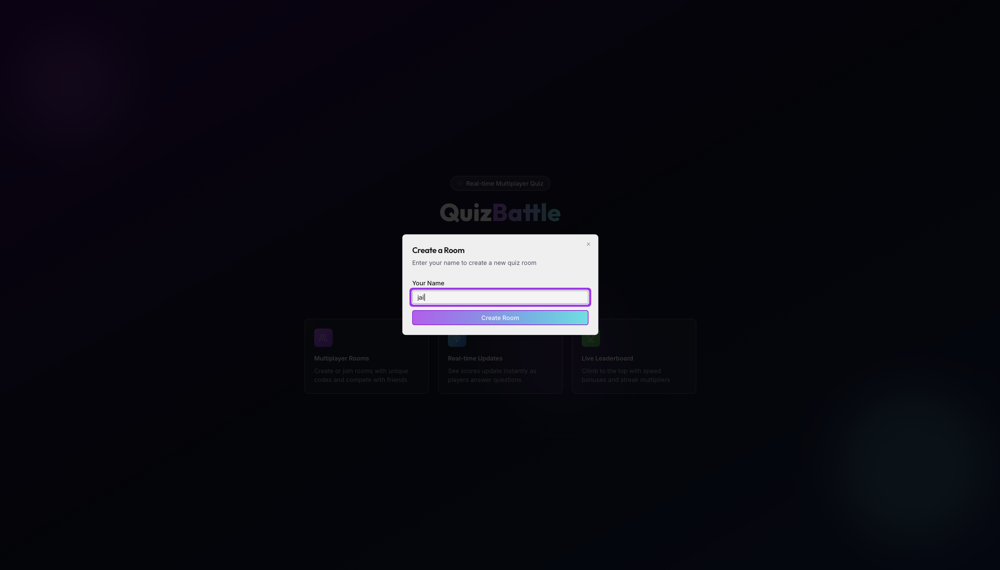

# 🧩 QuizSprint

> 🚀 **QuizSprint** is a real-time multiplayer quiz platform where users can join a room, compete live, and track results instantly — built with React, TypeScript, Express, and WebSockets.

---

## 🌟 Features

- ⚡ **Real-time gameplay** — Powered by WebSocket for instant updates  
- 🧑‍🤝‍🧑 **Multiplayer rooms** — Create or join rooms using unique codes  
- 🏆 **Live leaderboards** — See scores update after every question  
- 🎨 **Modern UI** — Beautiful neon gradient interface with confetti animations  
- 📷 **Screenshot feature** — Capture your final score page as an image  
- 🔁 **Play Again / New Quiz** options for replayability  
- 🌐 **Responsive PWA** — Works seamlessly on desktop and mobile  

---

## 🖼️ Screenshots

> 💡 Tip: Place your screenshots in a folder named `/assets` at the root of the repo and update the paths above accordingly.
